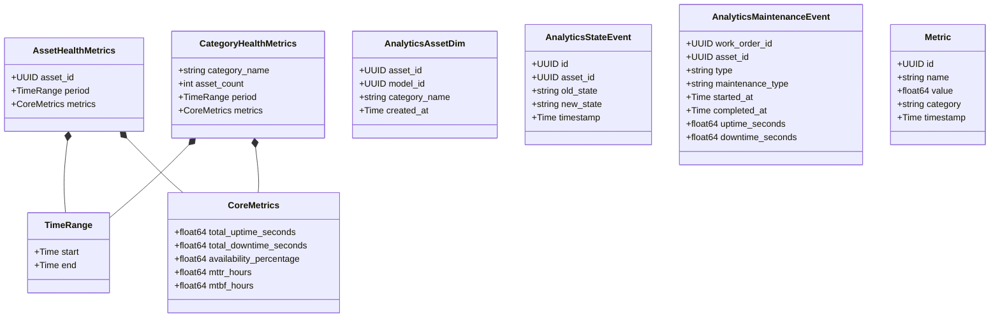
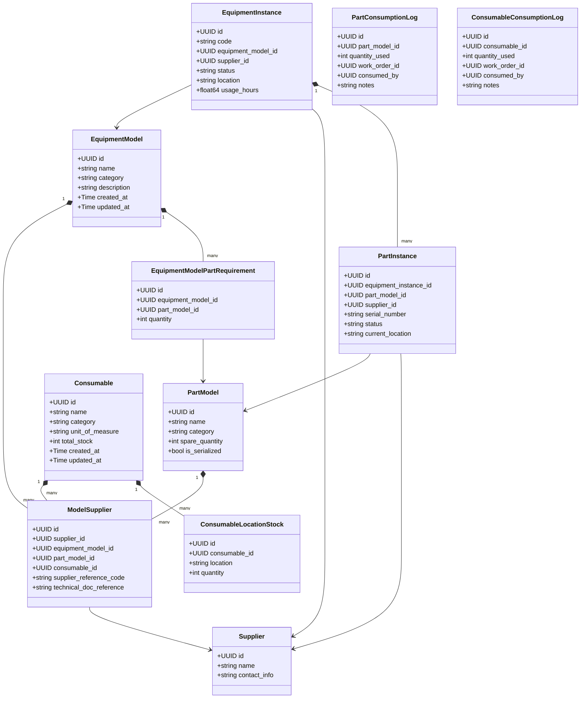
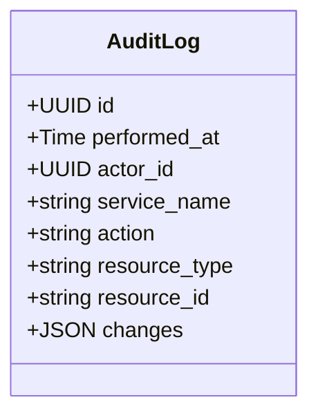
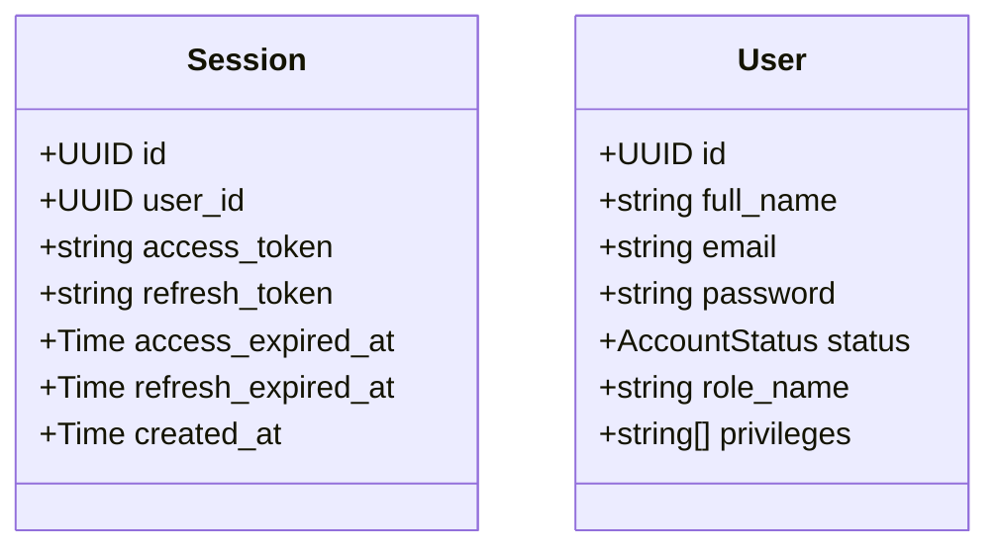
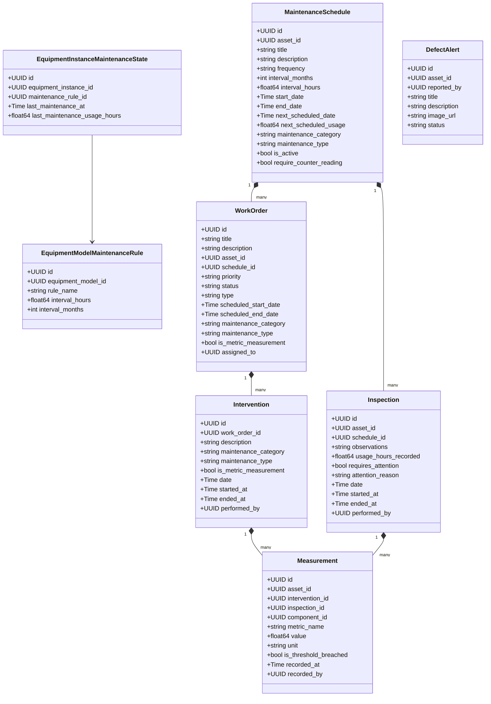
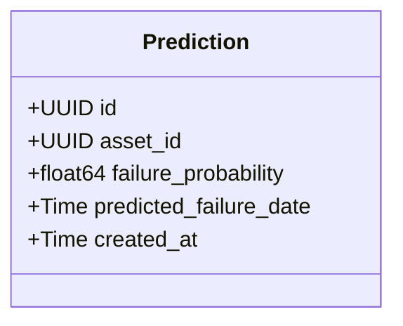
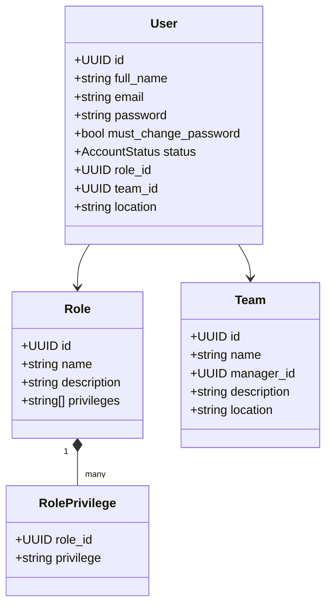

# Backend Services Class Diagrams

This document contains the structural class diagrams (Domain Models) for each microservice in the GMAO backend. These diagrams illustrate the core entities, their properties, and their relationships.

## Analytics Service

## Asset Service

## Audit Service

## Auth Service

## Maintenance Service

## Prediction Service

## User Service

## API Gateway
_The API Gateway proxies requests based on Consul service discovery and strips out internal headers. It operates entirely as an HTTP router and middleware provider, thus having no persistent domain entities or database._
